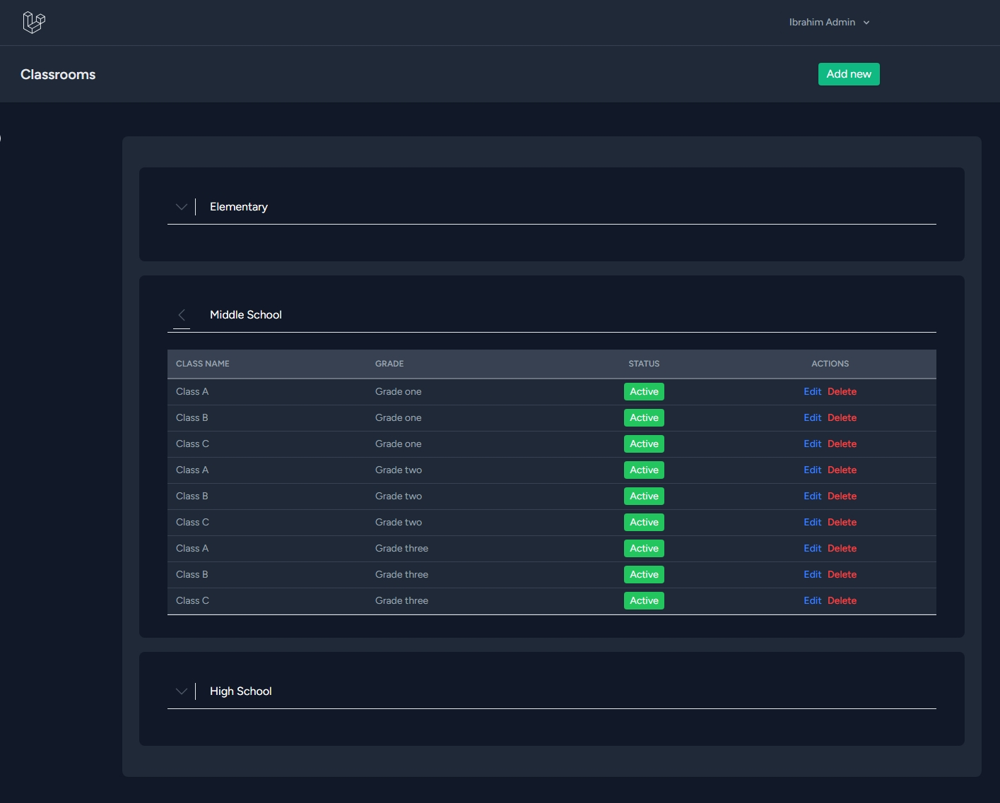
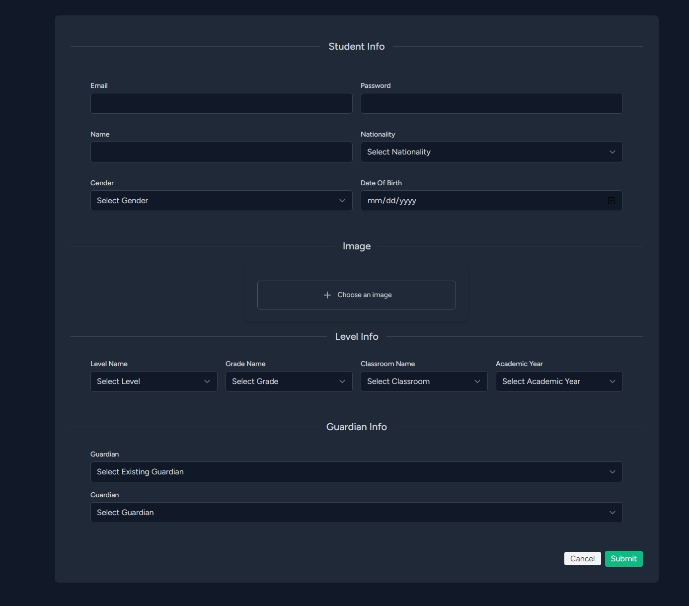
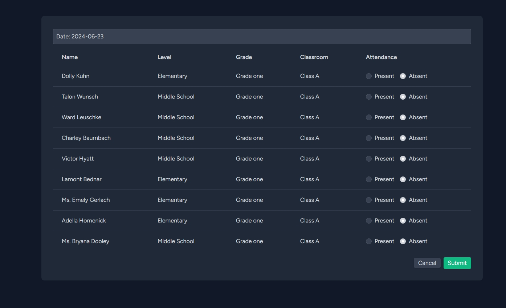
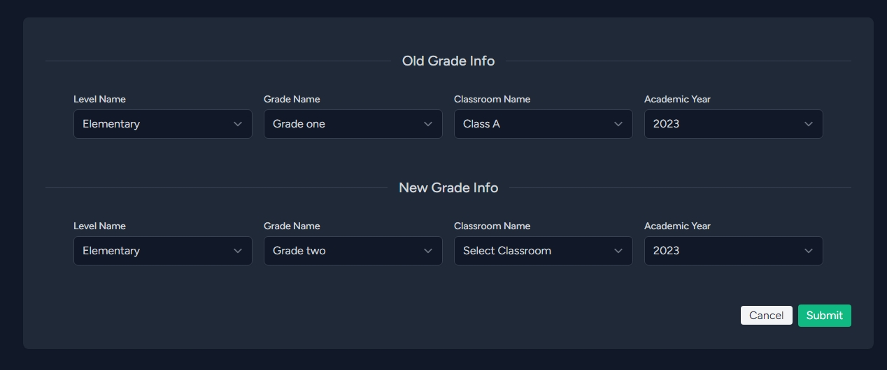
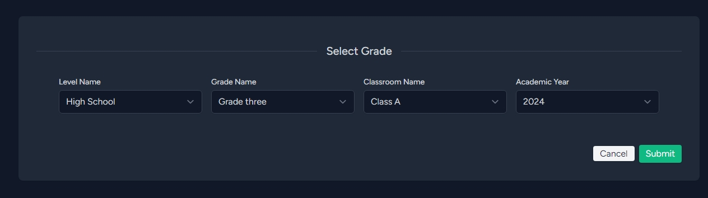
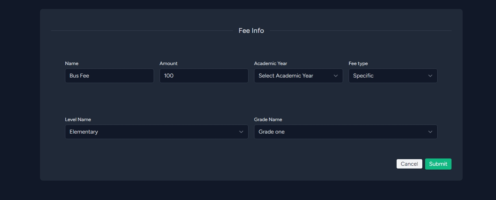

# School Management System

## Overview
This project aims to provide a comprehensive solution for managing various aspects of a school, including student information, fees, and administrative tasks.

## Features

### Levels, Grades, Classrooms
- **CRUD operations** for managing levels, grades, and classrooms.
- Assign teachers and students to classrooms.

### Students
- **CRUD operations** for managing student profiles.
- Upload student information, including images.
- Associate guardians with students and manage their information.

### Guardians
- **CRUD operations** for managing guardian profiles.
- Link guardians to their respective students for communication purposes.

### Promotions
- **CRUD operations** for managing student promotions to higher grades.
- Automated or manual promotion processes based on predefined criteria.

### Graduated Students
- **CRUD operations** for managing students who have successfully graduated.
- Archive student records and maintain alumni information.

### Fees System
- Flexible fee management system:
  - Define and manage fees specific to grades or as general fees (e.g., bus fees).
  - **CRUD operations** for managing fee specifications.
  - Generate and manage fee invoices for students.
  - Record and track payments received from students.
  - Deduct fees from student accounts as necessary.

### Teachers
- **CRUD operations** for managing teacher profiles.
- Attendance management page for tracking student attendance.

### Exams (Work in Progress)
- Page for managing and scheduling exams.
- Record exam results and generate reports for students and teachers.

## Technologies Used
- **Backend** :  Laravel 11
- **Frontend**: React with Inertia.js
- **Database**: MySQL

